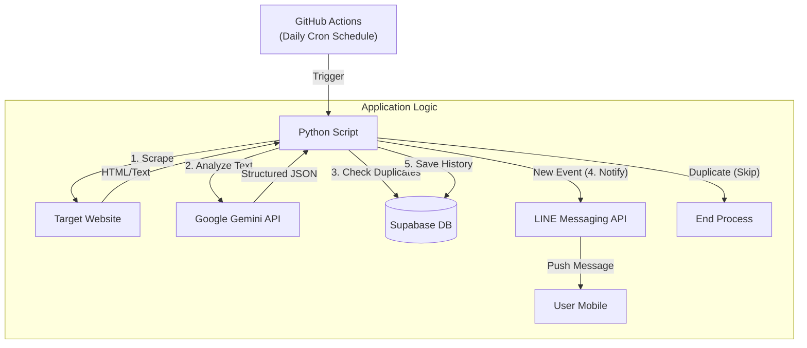

# 📅 AI-Powered Event Notifier (Oshikatsu Bot)

**Webサイト上のイベント情報をAIが自動抽出し、LINEで通知する自動化システム**

## 📖 概要 (Overview)

特定のWebサイトを定期的に巡回し、アーティストやイベントの最新情報（チケット発売日、イベント日程など）を自動で取得・通知するアプリケーションです。

従来のスクレイピングでは対応が難しかった「サイトごとに異なるHTML構造」や「曖昧な日付表記」の問題を、**Google Gemini（生成AI）** を用いた自然言語処理で解決。さらに **Supabase** で通知履歴を管理することで、情報の重複通知を防ぐ「冪等性（Idempotency）」を担保しています。

## 🏗️ システムアーキテクチャ (Architecture)

GitHub Actionsをトリガーとして、ETL（Extract, Transform, Load）ライクな処理パイプラインを構築しています。



## 🛠️ 技術スタック (Tech Stack)

| Category | Technology | Usage |
| --- | --- | --- |
| **Language** | Python 3.9 | メインロジックの実装 |
| **AI / LLM** | Google Gemini 2.5 Flash | 非構造化テキストからのイベント情報抽出・JSON成形 |
| **Database** | Supabase (PostgreSQL) | 通知済みイベントの永続化・重複排除 |
| **CI / CD** | GitHub Actions | 定期実行（Cron）環境の構築（サーバーレス運用） |
| **Notification** | LINE Messaging API | ユーザーへのプッシュ通知 |
| **Library** | BeautifulSoup4 | HTMLからのテキスト抽出 |

## 💡 こだわり・工夫した点 (Key Features)

### 1. 生成AIによる「柔軟なスクレイピング」

従来のCSSセレクタに依存したスクレイピングでは、サイトのレイアウト変更で頻繁に壊れる問題がありました。本システムでは、`BeautifulSoup` で取得した生のテキストを `Gemini API` に渡し、以下のプロンプトエンジニアリングによって情報を抽出しています。

* **文脈理解:** 「来週」「明日」といった相対的な日付表現や、曖昧なイベント名をAIが解釈。
* **JSON整形:** 後続の処理で扱いやすいよう、AIの出力を厳密なJSON形式に固定。

### 2. Supabaseによる「重複通知の防止」

単に情報を送るだけでなく、ユーザー体験（UX）を考慮しました。

* 取得したイベント名をデータベース（`notifications` テーブル）に保存。
* 通知前に必ずDB照会を行い、既知のイベントであれば処理をスキップ。これにより「同じ通知が毎日届く」というストレスを排除しています。

### 3. 完全サーバーレス・コストゼロ運用

* **GitHub Actions:** 実行環境として使用（1日1回の短時間実行のため無料枠内）。
* **Supabase / Gemini / LINE:** 全てフリープランの範囲内で動作するように設計。
* 常時起動のサーバーを持たないため、運用コストとメンテナンスコストを最小限に抑えています。

## 🚀 セットアップ (Installation)

### 必要要件

* Python 3.9+
* Supabase Account
* LINE Developers Account
* Google Cloud Platform Account (Gemini API)

### 環境変数 (Environment Variables)

本番環境（GitHub Secrets）およびローカル開発環境（`.env`）にて以下の変数を設定します。

```bash
TARGET_URL="https://example.com/artist_news"
GEMINI_API_KEY="your_gemini_api_key"
SUPABASE_URL="https://your-project.supabase.co"
SUPABASE_KEY="your_supabase_anon_key"
LINE_CHANNEL_ACCESS_TOKEN="your_line_token"
LINE_USER_ID="your_line_user_id"

```

## 📂 ディレクトリ構成

```text
.
├── .github/
│   └── workflows/
│       └── notify.yml   # GitHub Actions 定期実行設定
├── main.py              # アプリケーションのエントリーポイント
├── requirements.txt     # 依存ライブラリ一覧
└── README.md            # ドキュメント

```

## 🔮 今後の展望 (Future Roadmap)

* **複数サイトの並行監視:** 現在は単一URLのみだが、リスト形式で環境変数にURLを持たせ、ループ処理による複数サイト監視へ拡張予定。
* **エラーハンドリングの強化:** スクレイピング失敗時やAPIレート制限時の自動リトライ機能の実装。
* **ユーザー設定機能:** 監視対象やキーワードをLINEのトーク画面から設定できる対話型機能の追加。
